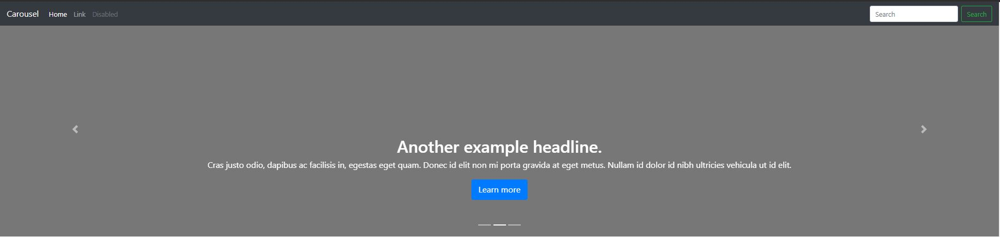
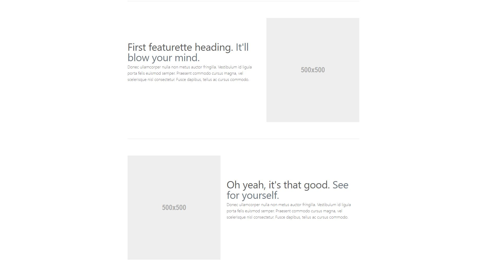

## Énoncé "Sujet Libre"  
D'après la maquette, faire l'intégration avec Bootstrap  

Vous pouvez utiliser les classes et composants :
* Carrousel
* card
* etc ...  

Header & Carrousel  
  
&nbsp;&nbsp;  
  
Section 1  
   
&nbsp;&nbsp;  
   
Section 2
   
&nbsp;&nbsp;  
&nbsp;&nbsp;  
   
 Footer
    
 &nbsp;&nbsp;  
 

